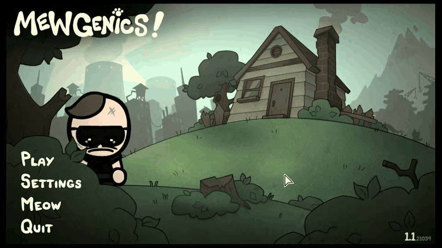

# OBS Telegram Overlay

Display live Telegram messages as a transparent overlay in OBS with automatic text-to-speech narration.

Perfect for:
- Stream alerts from Telegram channel/group
- Live chat overlay with voice narration
- Multi-language support (English, Russian, extensible)
- Clean, glassmorphism design that fits any stream

## Demo



## Features

✨ **Real-time messaging** — Messages appear instantly via SignalR  
🎤 **Local text-to-speech** — Server-side audio generation (macOS/Linux/Windows)  
🎨 **Transparent overlay** — Glassmorphism cards with fade-out animation  
🌐 **Auto language detection** — Detects Cyrillic → Russian, else English  
📱 **OBS-friendly** — Works seamlessly in OBS Browser Source  
🔒 **Self-contained** — Single portable executable, no dependencies  

## Installation

### macOS / Linux — one-liner

```bash
curl -fsSL https://raw.githubusercontent.com/ArtemKiyashko/obs-telegram-overlay/main/install.sh | bash
```

The script auto-detects your OS and architecture, downloads the latest release binary and installs it to `~/.local/bin`.

#### macOS first run (Apple security warning)

The install script automatically removes the quarantine attribute (`xattr`), but on the first launch macOS may still show a warning. If that happens:

1. Close the warning dialog (do not delete the file)
2. Open **System Settings** → **Privacy & Security**
3. Scroll down to the blocked app message
4. Click **Open Anyway**

After this one-time approval, the binary runs normally.

### Windows — one-liner (PowerShell)

```powershell
irm https://raw.githubusercontent.com/ArtemKiyashko/obs-telegram-overlay/main/install.ps1 | iex
```

Installs to `%LOCALAPPDATA%\obstelegramoverlay` and adds it to the user PATH.

### Manual install

Download the binary for your platform from [Releases](../../releases), make it executable (macOS/Linux: `chmod +x obstelegramoverlay_bot`) and run it directly.

## Quick Start

### 1. Get Your Bot Token

1. Open Telegram and chat with [@BotFather](https://t.me/botfather)
2. Send `/newbot` and follow instructions
3. Copy the API token (looks like `123456:ABC-DEF...`)

### 2. Configure Bot Privacy (BotFather)

Before adding the bot to a group, configure it in [@BotFather](https://t.me/botfather):

1. Send `/mybots` → select your bot → **Bot Settings** → **Group Privacy**
2. Set it to **Disabled** (so the bot receives all group messages, not just commands)

> **Why?** By default Telegram only delivers messages that start with `/` to bots in groups. Disabling Group Privacy allows the bot to see every message.

### 3. Add Bot to Chat/Channel

1. Open your Telegram group or channel
2. Click the group name → Add Members
3. Search for your bot and add it

> **Supergroups**: If your chat is a supergroup, the bot must be promoted to **admin**.
> No specific permissions are required — you can uncheck everything — but admin status is necessary for Telegram to forward all messages to the bot.

### 4. Run the Overlay

```bash
./obstelegramoverlay_bot --bot-api-token YOUR_TOKEN_HERE
```

The app will:
- Print the overlay URL: `http://127.0.0.1:5180`
- Wait for Telegram messages
- Show each message with the sender name and `chatId`

### 5. Add to OBS

1. In OBS, create a new **Browser Source**
2. Set URL to `http://127.0.0.1:5180`
3. Set resolution: **1920×1080** (or your stream resolution)
4. ✅ Messages will start appearing!

### 6. First Message (Audio Unlock)

When your first Telegram message arrives:
- A button will appear: **"Enable Audio"**
- **Right-click** the OBS Browser Source → **Interact**
- **Click** the button once
- Audio will then play automatically for all future messages

> **Why?** OBS Browser Source requires explicit user interaction before auto-playing audio (browser security policy).

### 7. Restrict the bot to specific chats

By default, the bot accepts messages from any chat where it was added.
If you want to allow only specific Telegram chats, use `--allowed-chat-ids`.

How to find the right `chatId`:

1. Start the app without any chat filter
2. Send a test message from the chat you want to use
3. Look at the overlay: the `chatId` is shown next to the sender name
4. Restart the app with that `chatId`

Example:

```bash
./obstelegramoverlay_bot --bot-api-token YOUR_TOKEN --allowed-chat-ids -1001234567890
```

Multiple chats are supported as a comma-separated list:

```bash
./obstelegramoverlay_bot --bot-api-token YOUR_TOKEN --allowed-chat-ids -1001234567890,-1009876543210
```

## Message Behavior

- **Display time**: 10 seconds (configurable)
- **Fade-out**: 600ms smooth transition
- **Max shown**: 20 messages on screen
- **Auto-removal**: Old messages clear automatically

## Advanced Options

All options have sensible defaults. You only need `--bot-api-token`. But if you want to customize:

```bash
./obstelegramoverlay_bot \
  --bot-api-token YOUR_TOKEN \
  --listen-url http://127.0.0.1:5180 \
  --allowed-chat-ids -1001234567890 \
  --message-ttl-seconds 15 \
  --speech-lang ru-RU \
  --speech-voice ru-RU-DariyaNeural \
  --speech-lang-mode fixed
```

**Available options:**

| Option | Default | Description |
|--------|---------|-------------|
| `--bot-api-token` | *(required)* | Telegram Bot API token |
| `--listen-url` | `http://127.0.0.1:5180` | Web server address |
| `--message-ttl-seconds` | `10` | How long to display each message |
| `--allowed-chat-ids` | *(all chats)* | Comma-separated list of allowed Telegram chat IDs |
| `--speech-engine` | `local` | `local` (native TTS), `piper` (offline neural, Linux only), `edge-tts` (online neural, Linux only) |
| `--speech-lang` | `ru-RU` | Default language for speech (`ru-RU`, `en-US`) |
| `--speech-lang-mode` | `auto` | `auto` (detect Cyrillic) or `fixed` (always use default) |
| `--speech-voice` | *(empty)* | Optional voice override. Uses engine defaults when empty. For `local`, this is the exact system voice name; for `piper`, a Piper model path/name; for `edge-tts`, a Microsoft voice name. |
| `--history-limit` | `100` | Max messages to keep in history |

## Keyboard Shortcuts

- **Ctrl+C** — Stop the app

## Troubleshooting

### Messages aren't appearing

- Check the bot token is correct
- Verify the bot is added to your Telegram chat/channel
- **Supergroup**: make sure the bot is promoted to admin (permissions can all be unchecked)
- **Group Privacy**: ensure it is set to **Disabled** in BotFather → Bot Settings → Group Privacy
- Try sending a test message in that chat

### No audio

- First message: Right-click OBS Browser Source → **Interact** → Click "Enable Audio" button
- OBS mixer: Check "Control audio via OBS" is enabled
- Levels: Look for green audio level indicators when messages arrive

### Wrong language

- Use `--speech-lang-mode fixed --speech-lang en-US` for English
- Or let auto-detection work (detects Russian by Cyrillic characters)

### Browser source shows blank

- Check URL: `http://127.0.0.1:5180`
- Ensure the app is running (look for "Overlay server started" message)
- Refresh the browser source (right-click → Refresh)

## Requirements

- **Telegram Bot** (free, create with [@BotFather](https://t.me/botfather))
- **OBS**: v28+ recommended

### Speech Synthesis (Linux only: piper or edge-tts)

For better audio quality on Linux, you can use `piper` (offline neural voices) or `edge-tts` (online Microsoft neural voices):

#### Piper (offline, recommended)

```bash
pip install piper-tts
# Download a voice model (optional, auto-downloads on first use):
piper --model ru_RU-dmitri_bozhinskiy-medium --help
```

Then run:
```bash
./obstelegramoverlay_bot --bot-api-token YOUR_TOKEN --speech-engine piper
```

You can also override the voice/model:
```bash
./obstelegramoverlay_bot --bot-api-token YOUR_TOKEN --speech-engine piper --speech-voice ru_RU-dmitri_bozhinskiy-medium
```

#### edge-tts (online, requires internet)

```bash
pip install edge-tts
```

Then run:
```bash
./obstelegramoverlay_bot --bot-api-token YOUR_TOKEN --speech-engine edge-tts
```

To choose a specific voice:
```bash
./obstelegramoverlay_bot --bot-api-token YOUR_TOKEN --speech-engine edge-tts --speech-voice ru-RU-DariyaNeural
```

### Native TTS (macOS, Windows, Linux fallback)

- **macOS**: Built-in `say` command (always available)
- **Linux**: `espeak-ng` (`apt install espeak-ng` on Ubuntu/Debian)
- **Windows**: Built-in (no extra install needed)

If you want to override the native voice, pass `--speech-voice` with the exact engine-specific voice name.

## License

MIT — Feel free to use, modify, and share!

---

**Questions?** Check the [Issues](../../issues) or create a new one.

Made with ❤️ for streamers who use Telegram.
